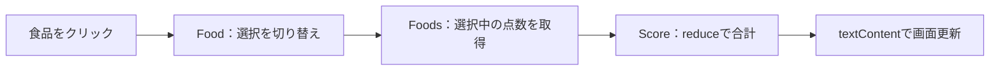

# TypeScript の勉強

**JavaScriptで動かす力 ＋ TypeScriptで型を扱う力 → 食品スコアアプリへ応用。**

このフォルダのコードで学ぶ技術を整理した復習用ガイド。詳細は各ファイルのコメントへ。

## 学習目的

| ファイル | 学ぶんだこと | できるようになること |
|---|---|---|
| [class.ts](src/class.ts) | **データと処理をまとめる** | 人物の名前・年齢・挨拶をクラスで管理する |
| [interface.ts](src/interface.ts) | **必要な項目・型を決める** | クラスや関数に必要な条件を型でチェックする |
| [advanced.ts](src/advanced.ts) | **値の種類を見分ける** | 文字列・数値・オブジェクトの種類に応じて処理を分ける |
| [generics.ts](src/generics.ts) | **型を変えて処理を再利用する** | 文字列用・数値用など、型を指定できるクラスや関数を作る |
| [decorator.ts](src/decorator.ts) | **クラスなどに処理を追加する** | ログ出力・HTML表示・メソッドの設定変更を付け加える |
| [food-app.ts](src/food-app.ts) | **学んだ技術で画面を動かす** | 食品の選択 → 点数集計 → 表示更新を実装する |

**実施した順序**

```text
class → interface → advanced → generics → decorator
  └ クラスと型の知識を使って、food-appで画面操作・集計を実践
```

## 技術一覧

### ① class.ts — オブジェクトの作成と継承

| 技術・記法 | 意味 | 使い方 |
|---|---|---|
| `class` / `new` | 設計図 / 実物の作成 | `Person`から人物を作る |
| `constructor` / `this` | 作成時の処理 / 自分自身 | 名前・年齢を自分に保存する |
| `public` / `protected` / `private` | 外部も可 / 自分と子だけ / 自分だけ | 名前・年齢・教科のアクセス範囲を決める |
| `readonly` | 作成後の再代入を禁止 | `id`・`name`の書き換えを防ぐ |
| 引数の`public`など | 引数を自分の項目へ自動保存 | `public name` → `this.name`への保存を省略記法で書く |
| `extends` / `super()` | 親を継承 / 親の初期化を実行 | `Teacher`で`Person`の仕組みを再利用する |
| メソッドの上書き | 子クラス用の処理に変更 | 教師の挨拶に教科を追加する |

### ② interface.ts — 型のルールを定義

| 技術・記法 | 意味 | このコードでの使い方 |
|---|---|---|
| `interface` | 必要な項目と型を定義 | `Human`に名前・年齢・挨拶を要求する |
| `(a: number, b: number): number` | 引数と戻り値の型 | 数値2つ → 数値1つの加算関数を定義する |
| `interface A extends B` | 型の条件を引き継ぐ | `Human`が`Namable`の名前を引き継ぐ |
| `class A implements B` | クラスが型の条件を満たすか検査 | `Developer`に`Human`の項目があるか確認する |
| `void` | 利用する戻り値がない指定 | 挨拶を表示する処理の型に使う |

### ③ advanced.ts — 型の組み合わせ・絞り込み

| 技術・記法 | 意味 | このコードでの使い方 |
|---|---|---|
| `A \| B` / `A & B` | どちらか / 両方の条件 | 技術者・ブロガーの型を組み合わせる |
| `typeof` / `in` / `instanceof` | 値の種類 / 項目の有無 / クラス由来を判定 | 分岐の中で型を絞り込む |
| `kind: 'bird'` | 決まった値を種類の目印にする | 鳥なら`fly()`を呼ぶ（タグ付きユニオン） |
| 関数のオーバーロード | 入力と出力の型の組を定義 | 文字列 → 文字列、数値 → 数値 |
| `as HTMLInputElement` | 入力要素の型として扱う | DOM要素の`value`を操作する |
| `[key: string]: string` | 任意のキーと値の型を定義 | デザイナー情報に項目を追加する |
| `user?` / `user?.name` | 項目の省略を許可 / 値がなければ参照を止める | 欠けたユーザー情報を扱う |

### ④ generics.ts — 型を受け取り、再利用する

| 技術・記法 | 意味 | このコードでの使い方 |
|---|---|---|
| `<T>` / `value: T` / 戻り値`: T` | 同じ型を入力・出力に使う | 渡したオブジェクトの型を保って返す |
| `T extends ...` | 受け取れる型を制限 | 文字列の`name`を持つデータに限定する |
| `keyof T` / `U extends keyof T` | キー一覧 / そのキーだけを許可 | 存在しない項目の指定を防ぐ |
| `LightDatabase<string>` | クラスで使う型を指定 | 文字列専用の配列に追加・削除する |
| `Partial<T>` / `Readonly<T>` | 各項目を省略可能 / 読み取り専用にする | `Todo`から別の型を作る |
| `Promise<string>` / `resolve` / `then` | 後で文字列を渡す / 成功通知 / 続きの処理 | タイマー完了後に文字列を処理する |
| `<T = any>` | 型を省略した場合の値 | `ResponseData`の既定の型を指定する |
| `[P in keyof ...]` / `-?` | キーごとに型を作る / 省略不可にする | 野菜の全項目を必須・読み取り専用にする |
| `T extends X ? A : B` | 条件で結果の型を選ぶ | `'tomato'`なら`string`、それ以外なら`number` |

### ⑤ decorator.ts — 対象に処理・設定を追加

| 技術・記法 | 意味 | このコードでの使い方 |
|---|---|---|
| `@Logging(...)` | 対象へデコレーターを適用 | クラス定義時にログを出す |
| 関数を返す関数 | 設定を受け取り、処理を作る | メッセージ付きのデコレーターを作る |
| クロージャー | 外側の変数を内側の関数で保持 | `message`・`template`をあとから使う |
| `return class extends ...` | 継承したクラスで置き換える | 作成時にHTMLを表示する処理を追加する |
| `target` / `propertyKey` / `descriptor` | 対象 / 項目名 / 設定情報 | メソッドなどの情報を確認・変更する |
| `get` / `set` | 読み取り時 / 代入時の処理 | `age`経由で内部の`_age`を扱う |
| `...args` | 引数をまとめる・展開する | 受け取った引数を親の処理へ渡す |

> このファイルは**全体をコメントアウト中**。`experimentalDecorators`を使う従来方式の学習例。

### ⑥ food-app.ts — 画面操作と集計を実装

| 技術・記法 | 意味 | このコードでの使い方 |
|---|---|---|
| `private static instance` | 外から触れない、クラス共通の保存先 | 作成済みの`Foods`・`Score`を保持する |
| `private constructor` / `getInstance()` | 作成の入口を限定 / 同じ実物を返す | 初回だけ作成して共有する（シングルトン） |
| `querySelector(All)` | HTML要素を取得 | 食品カード・点数・表示先を探す |
| `addEventListener` / `bind(this)` | イベント登録 / `this`を固定 | クリック時に担当する`Food`の処理を呼ぶ |
| `classList.toggle` / `contains` | CSSクラスの切り替え / 有無の確認 | 食品の選択・解除・抽出を行う |
| `get` / `forEach` / `push` | 読むと処理 / 各要素を処理 / 配列へ追加 | 選択カードと点数の配列を作る |
| `Number` / `reduce` / `String` | 数値化 / 集計 / 文字列化 | `['+5', '-3']` → `[5, -3]` → `2` → `'2'` |
| `textContent` | 要素の表示文字 | 合計点で画面を書き換える |
| 要素の後ろの`!` | nullでないと型検査へ伝える | スコア表示先がある前提で操作する |

## アプリ概要

**Food＝1枚の操作 ／ Foods＝一覧から抽出 ／ Score＝合計と表示**



これは**データ処理の流れ**。メソッドの呼び出し順は次のとおり。

```text
Food.clickEventHandler()
  → Score.render()
    → totalScore
      → Foods.activeElementsScore → activeElements
      → 点数を数値化 → 合計 → 表示
```

食品・点数はHTMLに定義。選択状態はCSSクラスで保持し、再読み込みでリセット。日付別の記録・サーバー通信・永続保存は未実装。

## メモ - 注意

| 混同しやすいもの | 違い |
|---|---|
| 型の指定 ↔ 実際の変換 | `as`・`!`は値を検証・変換しない。`Number()`は数値に変換する |
| `implements` ↔ `extends` | `implements`は条件の検査。クラスの`extends`は実装の継承 |
| `get totalScore()` ↔ `render()` | 前者は`.totalScore`で実行。後者は`.render()`で実行 |
| `Foods` ↔ `foods` | 前者はクラス名。後者は取得したオブジェクトを持つ変数名 |
